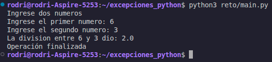
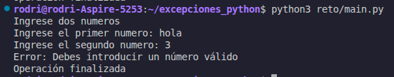
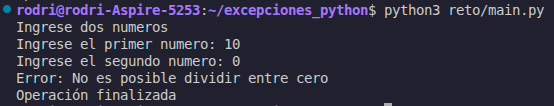

# División de Números con Manejo de Excepciones
 
Función en Python que solicita dos números al usuario, realiza una división y maneja los errores más comunes que pueden ocurrir durante ese proceso.
 
---
 
## Capturas de ejecución
 
### Ejecución sin errores
 

 
El usuario ingresa dos números enteros válidos y el segundo no es cero. La función realiza la división, muestra el resultado y confirma el cierre de la operación.
 
---
 
### Error: `ValueError`
 

 
El usuario ingresa un valor que no puede convertirse a entero (por ejemplo, una letra o una palabra). Python lanza un `ValueError` al intentar ejecutar `int()` sobre esa entrada, y la función captura ese error mostrando un mensaje descriptivo.
 
---
 
### Error: `ZeroDivisionError`
 

 
El usuario ingresa cero como segundo número. Al intentar dividir entre cero, Python lanza un `ZeroDivisionError`, y la función lo captura e informa al usuario que esa operación no es posible.
 
---
 
## Manejo de excepciones implementado
 
El código usa una estructura `try / except / finally` para controlar los posibles fallos sin interrumpir el programa abruptamente.
 
```python
try:
    ...
except ValueError:
    print("Error: Debes introducir un número válido")
except ZeroDivisionError:
    print("Error: No es posible dividir entre cero")
finally:
    print("Operación finalizada")
```
 
### Bloque `try`
 
Contiene todo el código que puede fallar:
 
- `input()` para capturar las entradas del usuario.
- `int()` para convertir esas entradas a números enteros.
- La operación de división `num1 / num2`.
Si cualquiera de esas líneas produce un error, Python detiene la ejecución del bloque `try` de inmediato y salta al `except` correspondiente.
 
---
 
### `except ValueError`
 
Se activa cuando `int()` recibe una cadena que no representa un número entero válido, por ejemplo `"hola"`, `"3.5"` o una cadena vacía. En ese caso se muestra:
 
```
Error: Debes introducir un número válido
```
 
---
 
### `except ZeroDivisionError`
 
Se activa cuando el segundo número es `0` y se intenta ejecutar `num1 / num2`. La división entre cero no está definida matemáticamente y Python lo refleja lanzando esta excepción. En ese caso se muestra:
 
```
Error: No es posible dividir entre cero
```
 
---
 
### Bloque `finally`
 
Se ejecuta **siempre**, sin importar si la operación fue exitosa o si se capturó algún error. Sirve para garantizar que ciertas acciones ocurran en todos los casos, como liberar recursos, cerrar archivos o, en este caso, notificar que la operación terminó:
 
```
Operación finalizada
```